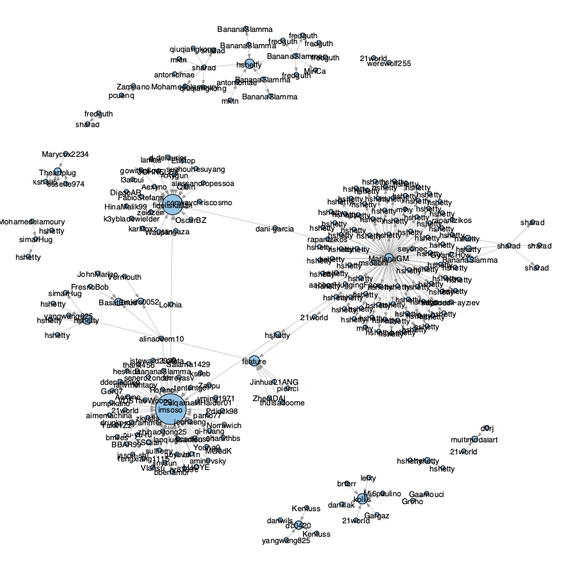

<!--
 * @Author: Rongxin rongxin@u.nus.edu
 * @Date: 2025-03-25 23:52:25
 * @LastEditors: Rongxin rongxin@u.nus.edu
 * @LastEditTime: 2025-03-26 01:49:41
 * @FilePath: /hugging-face-user-scrawler/README.MD
 * @Description: 这是默认设置,请设置`customMade`, 打开koroFileHeader查看配置 进行设置: https://github.com/OBKoro1/koro1FileHeader/wiki/%E9%85%8D%E7%BD%AE
-->

# Hugging Face User Crawler

A Scrapy-based web crawler designed to collect and analyze user data from Hugging Face, the popular machine learning platform. This project helps gather insights about user activities, contributions, and interactions within the Hugging Face community.

## Project Overview

This crawler is built to systematically collect user information from Hugging Face, including:
- User profiles
- Model contributions
- Dataset contributions
- Community interactions
- Activity statistics

## Folder Structure

```
hugging-face-user-scrawler/
├── config/               # Configuration files
├── data/                # Scraped data storage
├── doc/                 # Project documentation
├── hf_user_scrawler/    # Main crawler package
│   ├── spiders/        # Spider definitions
│   └── scrapy.cfg      # Scrapy configuration
├── logs/                # Log files
├── notebook/            # Jupyter notebooks for data analysis
├── script/             # Utility scripts
└── tmp/                # Temporary files
```

## Key Modules

### Spider Module
The main spider module is responsible for crawling Hugging Face user pages and extracting relevant information. It handles:
- User profile navigation
- Data extraction
- Rate limiting
- Error handling

### Data Processing
The data processing pipeline includes:
- Data cleaning and normalization
- JSON/CSV export functionality
- Data validation
- Storage management

### Configuration
The config module manages:
- Crawler settings
- API credentials
- Rate limiting parameters
- Output formatting

## Getting Started

1. Clone the repository
```bash
git clone https://github.com/yourusername/hugging-face-user-scrawler.git
cd hugging-face-user-scrawler
```

2. Install dependencies
```bash
conda env create -f config/conda.env
```

3. Configure the crawler
- Update settings in `config/`
- Set up your Hugging Face API credentials

4. Run the crawler
```bash
 scrapy crawl hf_user_scrawler -o ../data/result/users.jsonl  
```
5. Analyze the data
The result will be stored in `data/result/users.jsonl`. You can use the Jupyter notebooks in the `notebook/` folder to analyze the data.

## Sample Results
- Tasks generated
    ```csv
    user         , url
    crossdelenna , https://huggingface.co/crossdelenna
    Teetouch     , https://huggingface.co/Teetouch
    Janouille    , https://huggingface.co/Janouille
    orestxherija , https://huggingface.co/orestxherija
    edmundhui    , https://huggingface.co/edmundhui
    ```
- User profile
    ```json
    {
        "user_id": "Teetouch",
        "user_name": "Teetouch Jaknamon",
        "user_meta": "{\"lastUserActivities\":[],\"blogPosts\":[],\"totalBlogPosts\":0,\"canReadDatabase\":false,\"canManageEntities\":false,\"canReadEntities\":false,\"canImpersonate\":false,\"canManageBilling\":false,\"communityScore\":0,\"collections\":[],\"datasets\":[],\"models\":[{\"author\":\"Teetouch\",\"authorData\":{\"_id\":\"620b0b423c0931626a7c92c2\",\"avatarUrl\":\"/avatars/d150cef7965877a88d7400c431c626d7.svg\",\"fullname\":\"Teetouch Jaknamon\",\"name\":\"Teetouch\",\"type\":\"user\",\"isPro\":false,\"isHf\":false,\"isHfAdmin\":false,\"isMod\":false},\"downloads\":0,\"gated\":false,\"id\":\"Teetouch/TEETOUQQ2222-attacut-th-to-en-pt2\",\"availableInferenceProviders\":[],\"lastModified\":\"2022-03-10T17:45:31.000Z\",\"likes\":0,\"private\":false,\"repoType\":\"model\",\"isLikedByUser\":false}],\"numberLikes\":0,\"papers\":[],\"posts\":[],\"totalPosts\":0,\"spaces\":[],\"u\":{\"avatarUrl\":\"/avatars/d150cef7965877a88d7400c431c626d7.svg\",\"isPro\":false,\"fullname\":\"Teetouch Jaknamon\",\"user\":\"Teetouch\",\"orgs\":[],\"signup\":{},\"isHf\":false,\"isMod\":false,\"type\":\"user\"},\"upvotes\":0,\"repoFilterModels\":{\"sortKey\":\"modified\"},\"repoFilterDatasets\":{\"sortKey\":\"modified\"},\"repoFilterSpaces\":{\"sortKey\":\"modified\"},\"numFollowers\":0,\"numFollowingUsers\":0,\"numFollowingOrgs\":0,\"isFollowing\":false,\"isFollower\":false,\"sampleFollowers\":[],\"isWatching\":false,\"acceptLanguages\":[\"en\"]}",
        "team": null,
        "follower_amount": 0,
        "follower_meta": [],
        "following_amount": 0,
        "following_meta": []
    }
    ```
- Social edges
    ```csv
    source         , target
    mktn           , dc0420
    antoniomae     , Kentuss
    Mohamedelamoury, nlptown
    simarHug       , nlptown
    Wauplin        , nlptown
    ```
- Social network
  

## Author

- **Rongxin** - [rongxin@u.nus.edu](mailto:rongxin@u.nus.edu)

## Contributing

Contributions are welcome! Please feel free to submit a Pull Request.

## TODO  
[] Add frequency control  
[] Add proxy settings  
[] Add a mysql pipeline  
[] Add a sample analysis notebook  

## License

This project is licensed under the GNU General Public License v3.0 - see the [LICENSE](LICENSE) file for details.

